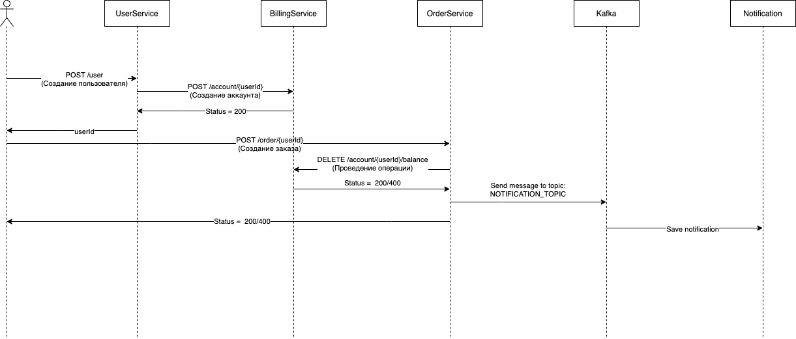

### Задание №6

Запуск приложения: `bash ./service.sh install` kafka стартует долго

Остановка приложения: `bash ./service.sh destroy`

Схема взаимодействия:

[Коллекция postman](./OtusHomework6.postman_collection.json)
